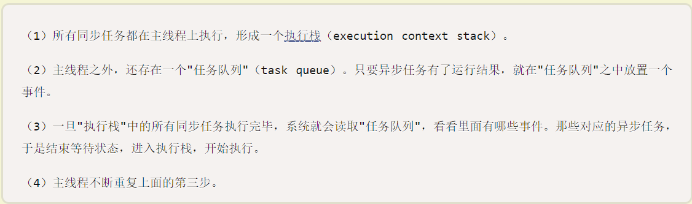
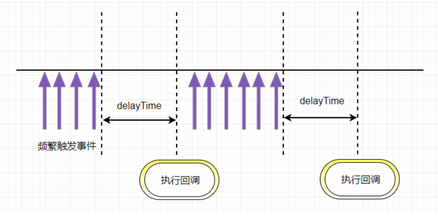
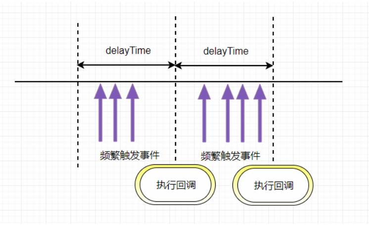

---
typora-copy-images-to:images
---

## 一，重排重绘回流

​		重绘就是在一个元素外观被改变，但没有改变布局的情况下发生。比如颜色，visibility， outline

重排就是DOM的变化影响了元素的几何属性，比如宽高。浏览器会重新计算元素的几何属性 如改变文字大小，内容，浏览器窗口变化，style属性的改变

reflow 回流： 当**渲染树**中的一部分(或全部)因为元素的**尺寸，布局，隐藏等改变**而需要重新构建。每个页面至少需要一次回流，就是在页面第一次加载的时候。

**注意**：回流必将引起重绘，而重绘不一定会引起回流。


## 二，不改变DOM结构的情况下，给图片设置300width

​		

```javascript
	<body>
		
	</body>
```

1,	设置最大宽度max-width: 300px;

2,	css3缩放      transform: scale(0.6, 0.6)      300/500   =  0.6

## 三，this指向问题

```javascript
		var fullname = "小明";
        var obj = {
            fullname: "小红",
            pop: {
                fullname: "小强",
                getFullname: function() {
                    return this.fullname;
                }
            }
        };
        console.log(obj.pop.getFullname()); //小强
        var fn = obj.pop.getFullname;
        console.log(fn()); //小明
```

## 三，盒模型和怪异盒模型

​		标准盒模型：width = content宽度

​		怪异盒模型(IE)： width = width + padding + border+ margin

​		box-sizing 属性允许您以特定的方式定义匹配某个区域的特定元素。

​		box-sizing: content-box;		宽度和高度分别应用到元素的内容框。在宽度和高度之外绘制元素的内边距和边框。

​		box-sizing: border-box;	 	为元素设定的宽度和高度决定了元素的边框盒。就是说，为元素指定的任何内边距和边框都将在已设定的宽度和高度内进行绘制。通过从已设定的宽度和高度分别减去边框和内边距才能得到内容的宽度和高度。

## 四，构造函数函数调用和普通函数调用的this指向

```javascript
var foo = 123;

        function print() {
            this.foo = 234,
                console.log(foo);
        }
		// print()
        new print();
```

## 五，一道经常被忽视的面试题

```javascript
 function Foo() {
            getName = function() {
                console.log(1);
            };
            return this;
        }
        Foo.getName = function() {
            console.log(2);
        };
        Foo.prototype.getName = function() {
            console.log(3);
        };
        var getName = function() {
            console.log(4);
        };

        function getName() {
            console.log(5);
        }


        // //请写出以下输出结果：
        Foo.getName(); // 2
        getName(); // 4
        Foo().getName(); // 1
        getName(); // 1
		new Foo.getName(); //2
        new Foo().getName(); //3
        new new Foo().getName();//3
```

## 六，如何判断一个数为整数

```javascript
function isInt(num) {
            console.log(num % 1);
            return num % 1 === 0;
        }

        console.log(isInt(4)); // true
        console.log(isInt(12.2)); // false
```

## 七，jQuery中$的实现原理

```javascript
	<div id="active">一</div>
    <div class="active">二</div>
    <div class="active">三</div>
    <script>
        // $('#active').css('background', 'red')

        function $(selector) {
        	// 每次调用$函数，返回Jquery的实例对象
            return new Jquery(selector)
        }

        function Jquery(selector) {
            //jQuery拿到的是一个伪数组，伪数组本质上还是对象
            this.elements = {}
            if (selector.charAt(0) === '#') {
                // call借用数组方法
 				[].push.call(this.elements, 	
                           document.getElementById(selector.substr(1)))
            }
            if (selector.charAt(0) === '.') {
                // apply借用数组方法
             	[].push.apply(this.elements,
                           document.getElementsByClassName(selector.substr(1)))
            }
        }
		// 方法添加在构造函数的原型对象上
        Jquery.prototype.css = function(attr, val) {
            if (typeof attr === 'string' && typeof val === 'string') {
                for (var i = 0; i < this.elements.length; i++) {
                    this.elements[i].style[attr] = val
                }
            }
            // 返回当前调用的实例对象
            return this
        }
		$('#active').css('color', 'hotpink')		// 实现链式调用
        $('.active').css('background', 'pink').css('border', '10px solid red')
         // $('#active').css('background', 'red')
        console.log($('.active'));
```

## 八，事件监听器实现

```javascript
EventTarget.prototype.add = function(type, fn) {
            if (!this.elist) {
                this.elist = {};
            }
            if (!this.elist[type]) {
                this.elist[type] = [];
            }

            this.elist[type].push(fn)
        }

        EventTarget.prototype.unadd = function(type, fn) {
            if (!this.elist) {
                return;
            }
            if (!this.elist[type]) {
                return;
            }
            var list = this.elist[type];
            for (var i = 0; i < list.length; i++) {
                if (fn === list[i]) {
                    list.splice(i, 1);
                    i--;
                }
            }
        }


        EventTarget.prototype.on = function(type) {
            if (!this.elist) {
                return;
            }
            if (!this.elist[type]) {
                return;
            }
            var list = this.elist[type];
            for (var i = 0; i < list.length; i++) {
                list[i]();
            }
        }

        var btn = document.querySelector('button');

        function fn1() {

            console.log('fn1');
        }
        btn.add('click', fn1);
        btn.add('click', function() {
            console.log('fn2');
        })
        btn.unadd('click', fn1);
        btn.onclick = function() {
            btn.on('click');
        }
	-----------------------------------------------------------------------------
     let selfEvent = {
            event: {},
            addEvent(eventName, fn) {
                if (!this.event[eventName]) {
                    this.event[eventName] = []
                }
                this.event[eventName].push(fn)
            },
            emit(eventName, eventMsg) {
                let fnList = this.event[eventName]
                fnList.forEach(item => item(eventMsg))
            },
            removeEvent(eventName, fn) {
                let fnList = this.event[eventName]
                fnList.forEach((item, index) => {
                    if (item === fn) {
                        this.event[eventName].splice(index, 1)
                    }
                })
            }
        }

        function fn1() {
            console.log('hi1');

        }
		//添加自定义事件
        selfEvent.addEvent('sayHi', fn1)
        selfEvent.addEvent('sayHi', function fn2() {
            console.log('hi2');
        })
        selfEvent.addEvent('sayHi', function() {
            console.log('hi3');
        })
        selfEvent.removeEvent('sayHi', fn2)
		//触发自定义事件
        selfEvent.emit('sayHi')

```

## 九，数组去扁平化并去重排序

```javascript
var arr = [
            [1, 2, 2],
            [3, 4, 5, 5],
            [6, 7, 8, 9, [11, 12, [12, 13, [14]]]], 10
        ]
// 基本写法
        let newArr = []
        function fun(arr) {
            arr.forEach((ele, index) => {
                if (ele instanceof Array) {
                    fun(ele)
                } else {
                    if (-1 === newArr.indexOf(ele)) {
                        newArr.push(ele)
                    }
                }
            })
            return newArr.sort(function(a, b) {
                return a - b
            })
        }
        console.log(fun(arr))
// es6写法
	console.log(Array.from(new Set(arr.toString().split(','))).sort((a,b)=>a-b).map(item=>Number(item)))
arr.toString()将数组转化为用逗号隔开的字符串，split(',')将逗号分隔的字符串转化为数组，new Set()去重，Array.from()将类数组转化为数组，sort()排序，map()把数组中的每一项转换成数字返回出来
```

## 十，JavaScript中的 Event Loop

​		1，JavaScript的单线程，与它的用途有关。作为浏览器脚本语言，JavaScript的主要用途是与用户互动，以及操作DOM。这决定了它只能是单线程，否则会带来很复杂的同步问题。比如，假定JavaScript同时有两个线程，一个线程在某个DOM节点上添加内容，另一个线程删除了这个节点，这时浏览器应该以哪个线程为准？

所以，为了避免复杂性，从一诞生，JavaScript就是单线程，这已经成了这门语言的核心特征，将来也不会改变。

​		2，为了利用多核CPU的计算能力，HTML5提出Web Worker标准，允许JavaScript脚本创建多个线程，但是子线程完全受主线程控制，且不得操作DOM。所以，这个新标准并没有改变JavaScript单线程的本质

* **任务队列**

  * 任务队列可以分为同步任务和异步任务两种：
    * **同步任务**：同步任务指的是，在主线程上排队执行的任务，只有前一个任务执行完毕，才能执行后一个任务
    * **异步任务**：异步任务指的是，不进入主线程、而进入"任务队列"（task queue）的任务，只有"任务队列"通知主线程，某个异步任务可以执行了，该任务才会进入主线程执行。
    * 具体来说，异步执行的运行机制如下。
    * 
    * 主线程从"任务队列"中读取事件，这个过程是循环不断的，所以整个的这种运行机制又称为Event Loop（事件循环）

  

  [JavaScript 运行机制详解：再谈Event Loop]: http://www.ruanyifeng.com/blog/2014/10/event-loop.html

  

## 十一，原型对象this指向

```javascript
function setname(name) {
            this.name = name
        }
        setname.prototype.printName = function () {
            console.log(this.name)
        }
        var a = new setname("cc")
        a.name = "dd"
        a.__proto__.name = "ee"

        a.__proto__.printName()  // ee
        a.printName() // dd
```

## 十二，实例对象和全局中的this

```javascript
var name = 'Jay'//tom
       
        function Person(name) {
           
            this.name = name;
            
            console.log(this.name);//tom
        }
        
        var a = Person('Tom');
        
        console.log(name);//tom
        
        console.log(a);//undefined
        

        
        var b = new Person('Micheal'); //Micheal
        
        console.log(b); // b这个实例对象
```

 

## 十三，变量预解析和隐式全局变量

```javascript
 // 1、-----------------------------------
        var num = 10;
        fun();

        function fun() {
            console.log(num);//undefined
            var num = 20;
        }

        // 2、-----------------------------------
        var a = 18;
        f1();

        function f1() {
            var b = 9;
            console.log(a);// undefined
            console.log(b);// 9
            var a = '123';
        }

        // 3、-----------------------------------
        f1();
        console.log(c);// 9
        console.log(b);// 9
        console.log(a);// error

        function f1() {
            var a = b = c = 9;
            console.log(a); //9
            console.log(b); //9
            console.log(c); //9
        }
```

## 十四，闭包和函数自调用中的this指向

```javascript
		var num = 20;
        var obj = {
            num: 30,
            fn: (function(num) {
                this.num *= 3; 
                num += 15;
                var num = 45;
                console.log(num);
                return function() {
                    this.num *= 4;
                    num += 20;
                };
            })(num),
        };
        var fn = obj.fn;
        fn();
        obj.fn();
        console.log(window.num, obj.num); // 240 120
// 这道题主要考验闭包和匿名函数自调用中的this指向
//fn()被调用时，this指向window，所以形参num的值为20，
```

## 十五， arguments对象

**定义**：由于JavaScript允许函数有不定数目的参数，所以我们需要一种机制，可以在函数体内部读取所有参数。这就是arguments对象的由来。

```javascript
 var f = function(one) {
            console.log(arguments[0]); //1
            console.log(arguments[1]); //2
            console.log(arguments[2]); //3
        }
        f(1, 2, 3);
        // arguments对象除了可以读取参数，还可以为参数赋值（严格模式不允许这种用法）

        var f = function(a, b) {
            arguments[0] = 3; //对a重新赋值
            arguments[1] = 2; //对b重新赋值
            return a + b;
        }
        console.log(f(1, 1)); //5
		//虽然arguments很像数组，但它是一个对象。数组专有的方法（比如slice和forEach），不能在				arguments对象上直接使用。

		//如果要让arguments对象使用数组方法，真正的解决方法是将arguments转为真正的数组。下面是两种常用		的转换方法：slice方法和逐一填入新数组。
		function fn() {
		let arr = [].slice.call(arguments)
		let arr1 = []
		for(let i = 0; i < arguments.length; i++) {
			arr1.push(arguments[i])
		}
		console.log(arr) // [1, 2, 3]
		console.log(arr1)// [1, 2, 3]
	}
		fn(1, 2, 3)

	// arguments对象带有一个callee属性，返回它所对应的原函数。 属性包含当前正在执行的函数。
	function fn1() {
		console.log(fn1 === arguments.callee) // true
	}
	fn1()
// // 写一个 function 让下面两行代码输出的结果都为 5 
   // console.log(add(2, 3)); 
    //console.log(add(2)(3)); 
 		var add = function() {
            var cache;
            if (arguments.length === 1) {
                cache = arguments[0];
                return function(number) {	//add(2)返回一个回调函数，此时add(2)加上(3),等于执												//行回调函数,参数为3
                    return cache + number;
                }
            } else {
                return arguments[0] + arguments[1];
            }
        }
        console.log(add(2, 3));	//5
        console.log(add(2)(3)); //5      
```

## 十六，多种方式实现数组去重

```javascript
// 数组去重
		var arr=['12','32','89','12','12','78','12','32'];
		// 我们首先考虑JS中最基本的数组去重方法--------------------------------无法去重对象和NaN
		// 封装一个去重函数
		function redundancy(array){
			var newarr=[];
			for (var i=0;i<array.length;i++) {//此处的遍历也可用each
				if(newarr.indexOf(array[i])===-1){
					newarr.push(array[i]);
				}
			}
			return newarr;
		}
		var arr1= redundancy(arr);
		console.log(arr1);
		
		
		// 然后换成我们刚学的ES6的方法进行数组去重--------------------------------无法去重对象
		arr2=[...new Set(arr)];
		console.log(arr2);
		// 如果这行代码不好理解的话
		function dedupe(array) {
		  return Array.from(new Set(array));       //Array.from()能把set结构转换为数组
		}
		// Set 对象允许你存储任何类型的唯一值，无论是原始值或者是对象引用。
		// Set对象是值的集合，你可以按照插入的顺序迭代它的元素。 Set中的元素只会出现一次，即 Set 中的元素是唯一的。

		// indexOf + filter 去重--------------------------------无法去重对象，NAN直接消失
		var arr = [0, 0, 1, 1, true, true, false, false, undefined, undefined, null, 						null, NaN, NaN, 'a', 'a', {}, {}]
        var newArr = []

        newArr = arr.filter(function(item, index) {
           
			// indexOf()  如果存在就返回当前下标，不存在返回-1
            return arr.indexOf(item) === index
        })
        console.log(newArr);
		
```

##  十七，this指向问题

```javascript
var num = 1; //4
        var obj = {
            num: 2, //3
            add: function() {
                this.num = 3;
                (function() {
                    console.log(this.num); //1
                    this.num = 4;
                })();
                console.log(this.num);
            },
            sub: function() {
                console.log(this.num);
            }
        }

        obj.add();
        console.log(obj.num); //3
        console.log(num); //4
        var sub = obj.sub;
        sub(); //4
```

## 十八，哈哈哈

```javascript
 		var b = 10;
        (function b(){
            b = 20;
            console.log(b);  //function b() {}
            console.log(window.b);  10// 在自执行函数中，函数优先b = 20被覆盖，
            						//此时window下的b没有改变
        })()
-----------------------------------------------------------------------------------------
        var a = {n:1};
        var b = a;
        a.x = a = {n:2};  

        console.log(a.x); // undefined
        console.log(b.x); //{n: 2}
```

## 十九，重写原型对象

#### 	属性查找原则

​	如果是获取操作

1. ​	会先在自身上查找，如果没有
2. 则根据`__proto__`对应的原型去找，如果没有
3. 一直找到`Object.prototyp`，如果没有，那就找不到了。

```javascript
function Person() {
            this.name = "lw";
            this.color = ["orange", "red"];
        }

        function Chinese() {}

        Chinese.prototype = new Person();

        var c1 = new Chinese();
        var c2 = new Chinese();

        c1.name = "zs";
        c2.color.push("black");

        console.log(c2.name); //lw
        console.log(c2.color); //["orange", "red","black"]
--------------------------------------------------------------------------------------
 function Person() {
            this.name = "lw";
            this.color = ["orange", "red"];
        }

        function Chinese() {} 

        var c1 = new Chinese();
        var c2 = new Chinese();
        Chinese.prototype = new Person();
        c1.name = "zs";
        c2.color="black";
        console.log(c2.name); //undefined
        console.log(c2.color);//black
```

## 二十，函数中的形参相当于在函数中使用var声明了一个变量

```javascript
		var bb = 1;
        function aa(bb) {
            var bb=1
            bb = 2;
            alert(bb);//2
            };
        aa(bb);
        alert(bb);//1
```

## 二十一，var和let的区别

```javascript
 for(var i = 0; i < 10; i++) {
            setTimeout(function() {
                console.log(i)  // 10个10     // setTimeout是异步任务，执行的时候for循环已经执											//行完毕，而十个定时器会在一秒后执行,由于var声明的变量											//定义在全局，i会被层层覆盖，最后就是10
            }, 1000)
        }
for(let i = 0; i < 10; i++) {
    setTimeout(function() {
        console.log(i)  // 1, 2, 3, 4, 5, 6, 7, 8, 9 
        				//let声明的变量拥有块级作用域 ,每次声明的i有自己的作用域，互不影响
    }, 1000)
}
-----------------------------------------------------------------------------------------
let和var声明的变量有什么区别?
let没有变量提升   var有
let拥有块级作用域  var没有块级作用域
let声明的变量不能重复声明 var可以
let存在暂时性死区   ES6 明确规定，如果区块中存在let和const命令，这个区块对这些命令声明的变量，从一开始就形成了封闭作用域。凡是在声明之前就使用这些变量，就会报错。
总之，在代码块内，使用let命令声明变量之前，该变量都是不可用的。这在语法上，称为“暂时性死区”


```

## 二十二，隐式全局变量

```javascript
(function() {
            var a = b = 5;
        })();
        console.log(b);  // 5
        console.log(a);  // 报错
```

## 二十三，别慌，占个坑

```javascript

```

## 二十四，防抖和节流

浏览器的resize，scroll，keypress，mouseover，input等事件在触发时，会不断调用绑定在事件上的回调函数，极大的浪费资源，降低前端性能。为了优化体验，需要对这类事件进行调用次数的限制。

#### **防抖（debounce）**

​			作用是短时间内多次触发同一个函数，只执行最后一次，或者只在开始时执行，以用户拖拽改变窗口大小，触发resize事件为例，在这个过程中窗口的大小一直改变，所有如果在resize事件中绑定函数，这个函数会一直触发，而在这种情况大多数是无意义的，还会照成资源的大量浪费，这个时候可以使用防抖函数来优化



```javascript
// debounce 函数接受一个函数和延迟执行的时间作为参数
function debounce(callback, delay) {
        let timerId = null
        return function() {
            // 获取函数的作用域和变量
            let context = this
            let args = arguments
            clearTimeout(timerId)
            timerId = setTimeout(() => {
                callback.apply(context, args)
            }, delay)
        }
    }

    function fn() {
        console.log(window.innerWidth)
    }

    window.addEventListener('resize', debounce(fn, 1000))

	在 resize 事件上绑定处理函数，这时 debounce 函数会立即调用，实际上绑定的函数是 debounce 函数内部返回的函数。每一次事件被触发，都会清除当前的 timer 然后重新设置超时调用。
只有在最后一次触发事件，才能在 delay 时间后执行
---------------------------------------------------------------------------
	我们也可以为 debounce 函数加一个参数，可以选择是否立即执行函数
    function debounce(func, delay, isStart) {
        var timerId = null
        return function () {
            var context = this
            var args = arguments
            if (timerId) clearTimeout(timerId)
            if (immediate) {
                var doNow = !timerId//第一次执行timerId为undefined也就是false，取反就是true
                timerId = setTimeout(function () {
                    timerId = null
                }, delay)
                if (doNow) {
                    func.apply(context, args);
                }
            } else {
                timerId = setTimeout(function () {
                    func.apply(context, args)
                }, delay)
            }
        }
    }

 function fn() {
        console.log(window.innerWidth)
    }

    window.addEventListener('resize', debounce(fn, 1000, true))
    
```

#### **节流（throttle）**

​			类似于防抖，节流是在一段时间内只允许函数执行一次。

应用场景如：输入框的联响，可以限定用户在输入时，只在每两秒钟响应一次联想。

可通过时间戳和定时器来实现



```javascript
//时间戳实现
	// 节流：当输入超过2s后打印

    const input = document.querySelector('input')

    function throttle(callback, delay) {
        let prev = Date.now()
        return function() {
            let context = this
            let args = arguments
            let now = Date.now()
            if (now - prev >= delay) { 	
                callback.apply(context, args)
                prev = Date.now()
            }
        }
    }
    function fn() {
        console.log(input.value)
    }
    input.oninput = throttle(fn, 2000)

    ----------------------------------------------------------------------------
// 定时器实现   
function throttle(callback, delay) {
        let timerId = null
        return function() {
            let context = this
            let args = arguments
            if (!timerId) {
                timerId = setTimeout(() => {
                    timerId = null	// 每次执行之后让定时器id重新为null
                    callback.apply(context, args)
                }, delay)
            }
        }
    }

    function fn() {
        console.log(window.innerWidth)
    }
    window.addEventListener('resize', throttle(fn, 2000))
	节流是在一段时间内只允许函数执行一次。
	
区别在于，使用时间戳实现的节流函数会在第一次触发事件时立即执行，以后每过 delay 秒之后才执行一次，并且最后一次触发事件不会被执行；而定时器实现的节流函数在第一次触发时不会执行，而是在 delay 秒之后才执行，当最后一次停止触发后，还会再执行一次函数。

	单用时间戳或者定时器都有缺陷，我们更希望第一次触发马上执行函数，最后一次触发也可以执行一次事件处理函数，可以把定时器和时间戳结合起来使用
```

## 二十五，parseInt

```javascript
 // what & why ?
        console.log(['1', '2', '1'].map(parseInt));

        //paesenInt  用于解析一个字符串 返回一个整数
        //parsenInt(string,radix)  radix是可选的可选。表示要解析的数字的基数。该值介于 2 ~ 36 之间。
        // 如果省略该参数或其值为 0，则数字将以 10 为基础来解析。如果它以 “0x” 或 “0X” 开头，将以 16 为基数。
        // 如果该参数小于 2 或者大于 36，则 parseInt() 将返回 NaN。
        arr.map(function(currentValue, index, arr) {
                    parseInt(currentValue, index, arr)
                    parseInt(1, 0) //1
                    parseInt(2, 1) //NaN
                    parseInt(3, 2) //NaN
                        })
    //  map方法： https://www.runoob.com/jsref/jsref-map.html 
    //  parseInt方法： 				      https://www.w3school.com.cn/jsref/jsref_parseInt.asp
           // https://www.bilibili.com/video/BV19i4y1b7Gg?from=search&seid=8064593694261936189
```

## 二十六，封装一个把当前页面所有标签存入数组中的函数（去重）

```javascript
//  题目：完成一个 getTags 函数，可以检测当前页面用到了哪些标签，函数返回包含标签的字符串的数组，
        // 比如在页面中运行 getTags() 之后，函数就返回数组 [‘html’, ‘head’ ‘body’, ‘div’, ‘p’] (顺序不重要)。
        // 注意：
        // 1、标签名称使用小写
        // 2、请使用ES5语法
        // 3、答题时不要使用第三方插件

       var arr = []
        var html = document.documentElement
        arr.push(html.tagName)
        getTags(html)

        function getTags(obj) {
            var child = obj.children
            for (var key in child) {
                if (child.hasOwnProperty(key)) {
                    var element = child[key]
                    console.log(element.tagName);
                    arr.push(element.tagName)
                    getTags(element)
                }
            }
            return unique(arr)
        }

        function unique(arr) {
            for (var i = 0; i < arr.length; i++) {
                for (var j = i + 1; j < arr.length; j++) {
                    if (arr[i] == arr[j]) {
                        arr.splice(j, 1)
                        i--			//splice会改变原数组
                    }
                }
            }
            return arr
        }
        console.log(arr.join(',').toLowerCase().split(','));
```


